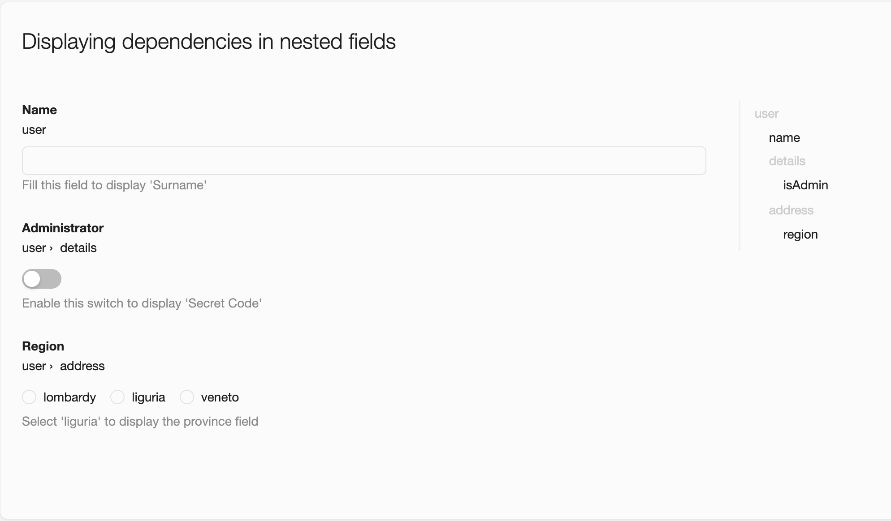
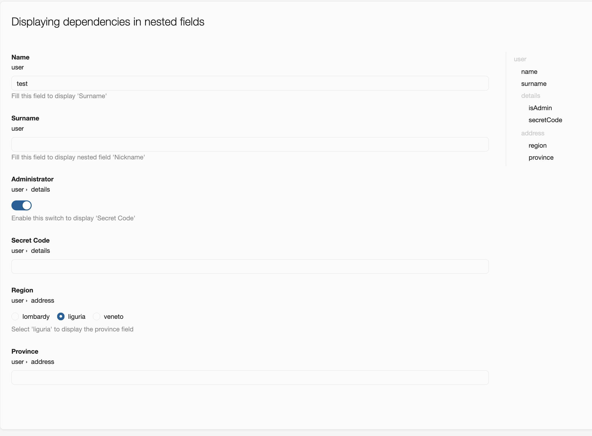

# Displaying Dependencies Form Fields Configuration

The Form widget supports a **`displayingDependencies`** configuration that allows fields to be dynamically shown or hidden depending on the value of another field.

This feature is useful when building progressive or guided forms, where some fields should only appear after:
- a parent field has been filled,
- a switch has been enabled,
- a specific option has been selected,
- or a field matches a precise value.

The goal is to reduce visual noise and improve the user experience by displaying only the fields that are currently relevant.

Example of Form before inserting values:



Example of Form after inserting values:



---

## Displaying Dependencies

### Description

The `displayingDependencies` property defines visibility rules between fields.

Each item describes:
- the field to display (`name`)
- the field it depends on (`dependsOn.name`)
- the visibility condition (`conditionType`)
- optionally, the expected value (`value`)

Notes:
- Hidden fields are not rendered.
- Visibility updates automatically when dependency fields change.
- Multiple fields can depend on the same parent field.
- Dependencies can target nested fields using dot notation.
- `displayingDependencies` only controls visibility and does not affect validation rules directly.

---

## Supported Conditions

### `notEmpty`

Displays the target field when the dependency field contains a non-empty value.

Supported checks:
- non-empty strings
- non-empty arrays
- non-null values
- booleans
- numbers

### `value`

Displays the target field only when the dependency field matches a specific value.

Supported value types:
- `string`
- `integer`
- `boolean`
- `array`
- `option`
- `null`

---

## Example (YAML)

```yaml
displayingDependencies:
  - name: surname
    dependsOn:
      name: name
      conditionType: notEmpty

  - name: middleName
    dependsOn:
      name: name
      conditionType: notEmpty

  - name: province
    dependsOn:
      name: region
      conditionType: value
      value:
        type: option
        optionValue:
          value: liguria
```

---

## Example Behavior

In this example:

- `surname` and `middleName` are displayed only after the `name` field has been filled.
- `province` is displayed only when the `region` field matches the value `liguria`.

This allows forms to progressively reveal additional fields only when they become relevant.

---

## Complete Example

```yaml
kind: Form
apiVersion: widgets.templates.krateo.io/v1beta1
metadata:
  name: example-form-displaying-dependencies
  namespace: krateo-system

spec:
  widgetData:
    displayingDependencies:
      - name: surname
        dependsOn:
          name: name
          conditionType: notEmpty

      - name: middleName
        dependsOn:
          name: name
          conditionType: notEmpty

      - name: province
        dependsOn:
          name: region
          conditionType: value
          value:
            type: option
            optionValue:
              value: liguria

    stringSchema: |
      {
        "type": "object",
        "properties": {
          "name": {
            "type": "string",
            "title": "Name",
            "description": "Fill this field to display dependent fields"
          },

          "middleName": {
            "type": "string",
            "title": "Middle Name"
          },

          "surname": {
            "type": "string",
            "title": "Surname"
          },

          "region": {
            "type": "string",
            "title": "Region",
            "enum": ["lombardy", "liguria", "veneto"]
          },

          "province": {
            "type": "string",
            "title": "Province"
          }
        }
      }
```

---

## Supported Value Configurations

### String

```yaml
dependsOn:
  name: typeField
  conditionType: value
  value:
    type: string
    stringValue: test
```

### Integer

```yaml
dependsOn:
  name: typeField
  conditionType: value
  value:
    type: integer
    integerValue: 2
```

### Boolean

```yaml
dependsOn:
  name: typeField
  conditionType: value
  value:
    type: boolean
    booleanValue: true
```

### Array

```yaml
dependsOn:
  name: tags
  conditionType: value
  value:
    type: array
    arrayValue: ['frontend', 'backend']
```

### Option

Useful for fields using options (such as fields configured using the `autocomplete` or `dependencies` properties).

```yaml
dependsOn:
  name: region
  conditionType: value
  value:
    type: option
    optionValue:
      value: liguria
```

You can also match both `value` and `label`:

```yaml
dependsOn:
  name: region
  conditionType: value
  value:
    type: option
    optionValue:
      value: "7"
      label: "Liguria"
```

### Null

```yaml
dependsOn:
  name: optionalField
  conditionType: value
  value:
    type: null
```