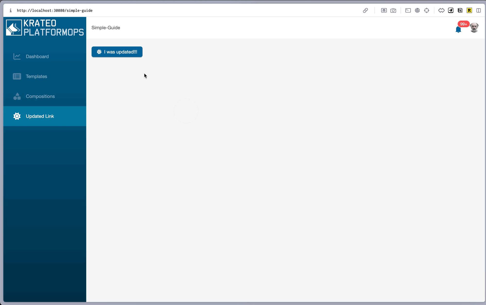

# Action Button guide

## Prerequisites

NB: This guide depends on [Simple page guide](../simple-page/simple-page.md) complete it first.

## Where we left off

We have created a `Button`(`metadata.name=simple-guide-button`) and a `Page`(`metadata.name=simple-guide-page`) that references it. In order to see dispaly the page we created a `NavMenuItem` that navigates to it.

## Next steps

We will update the `Button` to trigger an action on click, there are different types of actions that can be triggered by a button, in this guide we will use the `openDrawer` action, more info about actions can be found in [docs](../../docs.md)

NB: the namespace and the name of the `Button` is the same as the one used in the [Simple page guide](../simple-page/simple-page.md), so beware that we will overwrite the one created in the previous guide.

```sh
kubectl apply -f docs/guides/action-button/guide-action-button.yaml
```

Try clicking the button, you should see a drawer with the content of the `Paragraph` widget we declared in the `resourcesRefs` section.



## Lets make a step forward

Le's introduce a new widget, the `Form` widget, this widget can be used to create a new resource in the cluster.

```sh
kubectl apply -f docs/guides/action-button/guide-action-button-form.yaml
```

NB: this is a different file that the previous one that uses the same `Button` widget but with a different widget referenced in the action, so it will overwrite the previous one.

Clicking the button should open a drawer with a form, fill the form and click submit, you should see a new pod created in the cluster.


### how it works

The `Form` rest action is used to create a new resource in the cluster, in this example it uses a static stringSchema, usually this schema or a resource is retrieved from the cluster using a restAction.

The `payloadToOverride` is used to override the payload of the `rest` action with the value from the form.
The `payloadKey` section is used to specify the key of the payload to override, in this case `spec`
