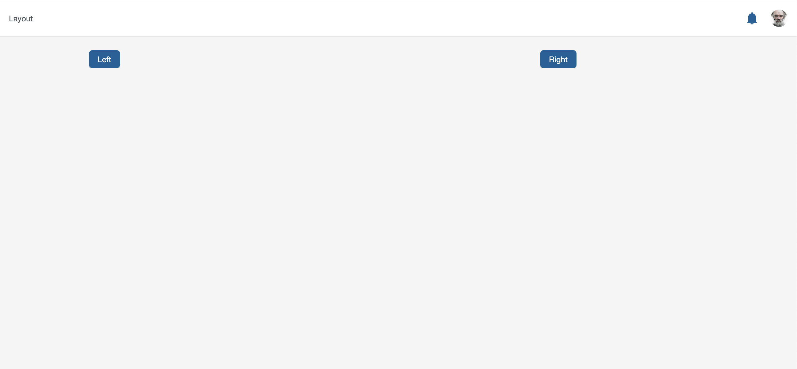
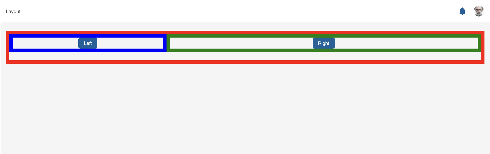

# How to Configure a layout

The main pillar of the Krateo frontend is **composability** (this is why it is called *Krateo Composable Portal*). The goal is to allow platform engineers to combine different Kubernetes resources, called **widgets**, and render them as UI elements, each with its own behavior and configuration.

Widgets can be grouped into three macro categories:
- **Functional widgets**: widgets that provide user-facing functionality or interaction and represent a meaningful UI feature, such as `Button`, `FlowChart`, `Table`, etc.
- **Layout widgets**: widgets that arrange, structure, or position other widgets, such as `Column`, `Row`, `DataGrid`, or `Page`.
- **Utility widgets**: widgets that enable application-level or cross-cutting features, such as `NavMenuItem`, `Filters`, or `RoutesLoader`.

This guide focuses on **layout widgets**, explaining how to use and combine them to build a page that contains and organizes other widgets.

---

## Layout Widgets

A non-exhaustive list of available layout widgets includes:

- **`Column`**: arranges its children in a vertical stack, aligning them one above the other with configurable spacing.
- **`Row`**: arranges its children horizontally with spacing between them.
- **`DataGrid`**: renders its children as a responsive list or grid, adapting to screen size and configuration.
- **`Page`**: a top-level wrapper component that defines a page and renders all nested widgets.
- **`TabList`**: displays a set of tabs used for navigation or content grouping.

> **Note**
> Layout widgets are not strictly required to display functional widgets. Functional widgets can be added directly as children of a `Page` widget and will be rendered vertically with default spacing. Layout widgets become essential when building more complex or responsive layouts.

---

## Basic Steps

To configure a layout, follow these steps:
1. Create a **`Page`** widget that will act as the container for all other widgets.
2. Create a **`NavMenuItem`** widget, which represents an entry in the navigation menu and links to a specific route and `Page`.
3. Create one or more **layout widgets** (`Column`, `Row`, `DataGrid`, etc.) and link them as children of the `Page` widget.
4. Create **functional widgets** and assign them as children of the chosen layout widgets.

---

## Example

> **Note**
> To follow this guide, you need to run the Krateo frontend locally. This requires:
> - a running Kubernetes cluster (for example, a local `kind` cluster),
> - the Krateo frontend codebase,
> - the ability to create and edit Kubernetes resources as YAML files.
>
> Refer to the [installation guide](../../../README.md#running-locally) in the repository README for setup instructions.

### Creating a Page

The first step is to create a `Page` widget. This widget acts as the root container for all layout and functional widgets belonging to a specific page.

At this stage, the `Page` widget does not need to define any children. Layout and functional widgets will be added and linked to it in the following steps.

Create a new file called `example-layout-page.yaml` with the following content:

```yaml
kind: Page
apiVersion: widgets.templates.krateo.io/v1beta1
metadata:
  name: example-layout-page
  namespace: krateo-system
spec:
  widgetData:
    allowedResources:
      - rows
    items: []
  resourcesRefs:
    items: []
```

After saving the file, create the widget by applying it to the cluster:

```sh
kubectl apply -f docs/guides/layout/example-layout-page.yaml
```

### Creating a NavMenuItem

To make the newly created `Page` accessible from the UI, we need a navigation entry. This is done by creating a `NavMenuItem` widget, which links a route in the application to the `Page` widget.

Create a new file called `example-layout-navmenuitem.yaml` with the following content:

```yaml
kind: NavMenuItem
apiVersion: widgets.templates.krateo.io/v1beta1
metadata:
  name: example-layout-navmenuitem
  namespace: krateo-system
spec:
  widgetData:
    allowedResources:
      - pages
    resourceRefId: example-layout-page
    label: Layout
    icon: fa-pager
    path: /layout
  resourcesRefs:
    items:
      - id: example-layout-page
        apiVersion: widgets.templates.krateo.io/v1beta1
        name: example-layout-page
        namespace: krateo-system
        resource: pages
        verb: GET
```

Apply the widget with the following command:

```sh
kubectl apply -f docs/guides/layout/example-layout-navmenuitem.yaml
```

After refreshing the UI, a new item labeled **Layout Example** should appear in the sidebar. Clicking it will navigate to the `/layout-page` route, where an empty page is expected at this stage.

### Creating the structure and the content

To add content to the page, we first define a layout structure and then populate it with functional widgets.

In this example, we want to display two buttons with different call-to-action behaviors (NOTE: for mocking purposes, both buttons will self navigate to the current page). The buttons should be horizontally aligned, each centered within its own column, and the two columns should have different widths.

To achieve this structure, we will create the following widgets:
- 1 `Row` widget, which arranges its children horizontally
- 2 `Column` widgets, each hosting a button
- 2 `Button` widgets

Start by creating the two `Button` widgets in the following files:

`example-layout-button-left.yaml`:

```yaml
kind: Button
apiVersion: widgets.templates.krateo.io/v1beta1
metadata:
  name: example-layout-button-left
  namespace: krateo-system
spec:
  widgetData:
    label: Left
    type: primary
    shape: default
    clickActionId: navigate-self
    actions:
      navigate:
        - id: navigate-self
          path: /layout
          type: navigate
  resourcesRefs:
    items: []
```

`example-layout-button-right.yaml`

```yaml
kind: Button
apiVersion: widgets.templates.krateo.io/v1beta1
metadata:
  name: example-layout-button-right
  namespace: krateo-system
spec:
  widgetData:
    label: Right
    type: primary
    shape: default
    clickActionId: navigate-self
    actions:
      navigate:
        - id: navigate-self
          path: /layout
          type: navigate
  resourcesRefs:
    items: []
```

Next, create two `Column` widgets, each referencing one of the buttons as its child:

`example-layout-column-left.yaml`:

```yaml
kind: Column
apiVersion: widgets.templates.krateo.io/v1beta1
metadata:
  name: example-layout-column-left
  namespace: krateo-system
spec:
  widgetData:
    allowedResources: [buttons]
    items:
      - resourceRefId: example-layout-button-left
  resourcesRefs:
    items:
      - id: example-layout-button-left
        apiVersion: widgets.templates.krateo.io/v1beta1
        name: example-layout-button-left
        namespace: krateo-system
        resource: buttons
        verb: GET
```

`example-layout-column-right.yaml`:

```yaml
kind: Column
apiVersion: widgets.templates.krateo.io/v1beta1
metadata:
  name: example-layout-column-right
  namespace: krateo-system
spec:
  widgetData:
    allowedResources: [buttons]
    items:
      - resourceRefId: example-layout-button-right
  resourcesRefs:
    items:
      - id: example-layout-button-right
        apiVersion: widgets.templates.krateo.io/v1beta1
        name: example-layout-button-right
        namespace: krateo-system
        resource: buttons
        verb: GET
```

Finally, create a `Row` widget that acts as the container for the two columns. Create a file called `example-layout-row.yaml` with the following content:

```yaml
kind: Row
apiVersion: widgets.templates.krateo.io/v1beta1
metadata:
  name: example-layout-row
  namespace: krateo-system
spec:
  widgetData:
    allowedResources: [columns]
    alignment: center
    items:
      - resourceRefId: example-layout-column-left
        alignment: center
        size: 8
      - resourceRefId: example-layout-column-right
        alignment: center
        size: 16
  resourcesRefs:
    items:
      - id: example-layout-column-left
        apiVersion: widgets.templates.krateo.io/v1beta1
        name: example-layout-column-left
        namespace: krateo-system
        resource: columns
        verb: GET
      - id: example-layout-column-right
        apiVersion: widgets.templates.krateo.io/v1beta1
        name: example-layout-column-right
        namespace: krateo-system
        resource: columns
        verb: GET
```

Apply all newly created widgets:

```sh
kubectl apply -f docs/guides/layout/example-layout-button-left.yaml
kubectl apply -f docs/guides/layout/example-layout-button-right.yaml
kubectl apply -f docs/guides/layout/example-layout-column-left.yaml
kubectl apply -f docs/guides/layout/example-layout-column-right.yaml
kubectl apply -f docs/guides/layout/example-layout-row.yaml
```

### Updating the Page widget

To render the newly created layout, update the original `Page` widget so that it references the top-level widget in the hierarchy, which is the `Row` widget.

The updated `example-layout-page.yaml` should look like this:

```yaml
kind: Page
apiVersion: widgets.templates.krateo.io/v1beta1
metadata:
  name: example-layout-page
  namespace: krateo-system
spec:
  widgetData:
    allowedResources:
      - rows
    items:
      - resourceRefId: example-layout-row
  resourcesRefs:
    items:
      - id: example-layout-row
        apiVersion: widgets.templates.krateo.io/v1beta1
        name: example-layout-row
        namespace: krateo-system
        resource: rows
        verb: GET
```

Apply the file again to update the `Page` widget:

```sh
kubectl apply -f docs/guides/layout/example-layout-page.yaml
```

After refreshing the UI, the page should now display two buttons aligned horizontally, each placed inside a column with a different width.



This is the actual underlying structure:



The red bordered element represents the `Row` widget, while the two bordered elements in blue and green are the `Column` widgets with their different sizes.

The complete example YAML file can be found [here](./layout.yaml).