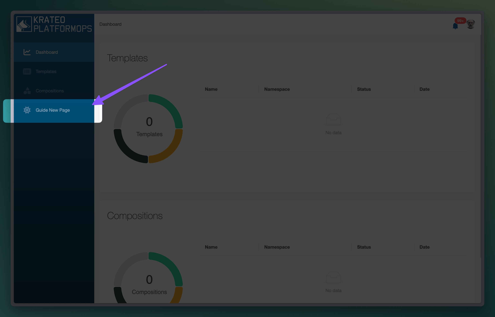
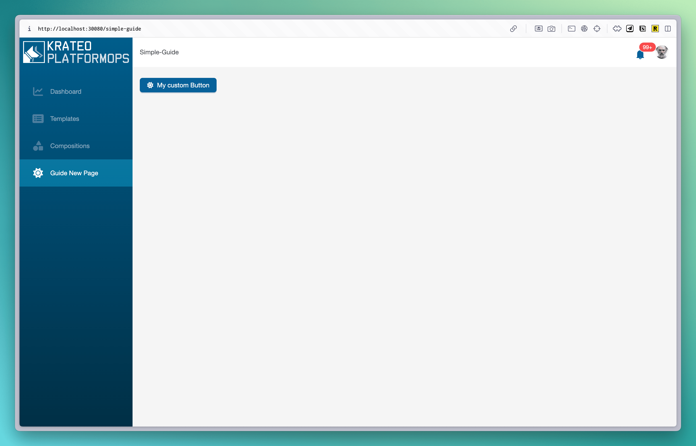
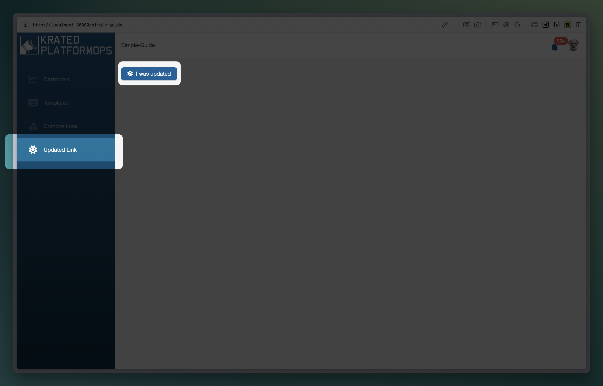

# Simple page guide

By following this guide you'll learn how to:

- create a Button widget
- Create a page widget that show the Button
- Create a link in the sidebar to navigate the page

## Prerequisites

### A cluster running krateo v2.5.0+

For testing/demo purposed a new cluster can be crated using kind ([more info](https://docs.krateo.io/quickstart)) by running:

```sh
curl -L https://github.com/krateoplatformops/krateo-v2-docs/releases/latest/download/kind.sh | sh
```

Launch this command to wait the Krateo platform to initialize

```sh
kubectl wait krateoplatformops krateo --for condition=Ready=True --namespace krateo-system --timeout=500s
```

When ready it will print:

```sh
krateoplatformops.krateo.io/krateo condition met
```

From now on you should be able to reach the Krateo's frontend at `http://localhost:30080`

#### Login

The credential to login this test cluster are
username: `admin`
password: created during init, retrievable running `kubectl get secret admin-password  -n krateo-system -o jsonpath="{.data.password}" | base64 -d` (beware of trailing `%` symbol in the terminal, it is not part of the password)


#### The Krateo UI

After logging in you will be presented the Krateo's starter UI


### Create a namespace for our widgets.

```sh
kubectl create ns simple-guide
```

## Creating a Button widget.

The creation of a Button widget is as simple as applying a yaml a kind of type Button with the required properties inside `spec.widgetData`. (widgetData validation is run when doing an apply to make sure required properties are present)

```sh
kubectl apply -f docs/guides/simple-page/guide-simple-button.yaml
```

To verify the widget has been correctly created, run

```sh
kubectl get button -n  simple-guide
```

## Showing the Button widget in a new Page

The Button widget is correctly created in the cluster, but in order for it to be visible is needs to be references by another visible widget.

We will insert the `Button` in a new `Page` widget.

```sh
kubectl apply -f docs/guides/simple-page/guide-simple-page.yaml
```

by examining [/docs/guides/simple-page/guide-simple-page.yaml](/docs/guides/simple-page/guide-simple-page.yaml) we can see that we referenced our Button by name in `spec.resourcesRefs` and added an id (`simple-button-id`).

Declaring resurces in `spec.resourcesRefs` is the way Krateo knows to load these widgets, they can be declare manually like in our case or dynamically (see `resourcesRefsTemplate` section in [docs](../../docs.md) for more info.) This concept is generic to any widget and is used to load other resources.

## Where is the Page?

We have created a `Button` and a `Page`(`metadata.name=simple-guide-page`) that references the `Button` (`metadata.name=simple-guide-button`) but nothing is yet visible in the UI.

### Creating a new link in the sidebar

We need a way to navigato to this page, to do so we will create a `NavMenuItem` that point reference the newly created page by running

```sh
kubectl apply -f docs/guides/simple-page/guide-simple-navmenuitem.yaml
```

Now refreshing the page will show the newly navigation item in the sidebar


### Visiting the new page

Clicking to the new sidebar menu will navigate to the path declared in the `NavMenuItem` `spec.widgetData.path` property and finally display our `Button` widget!



## Recap

We created a hierarchy or widget declaratively
`NavMenuItem` -> `Page` -> `Button`

- Widgets load other widgets via by referencing them inside `spec.resourcesRefs` and display them by using referencing the `resourcesRef` id inside `spec.widgetData`

## Testing the declarative nature of widgets

Try editing the `spec.label` prop of the yaml file in `guide-simple-button.yaml` or `guide-simple-navmenuitem.yaml` and apply the changes.

```sh
kubectl apply -f docs/guides/simple-page/guide-simple-navmenuitem.yaml
kubectl apply -f docs/guides/simple-page/guide-simple-button.yaml
```

After a refresh of the page you'll be able to see the changes reflected in the UI



## Next steps

A `Button` that does nothing is not very useful, in the next guide we will see how to update the `Button` to trigger an action on click.

Next: [Action button](/docs/guides/action-button/action-button.md)
